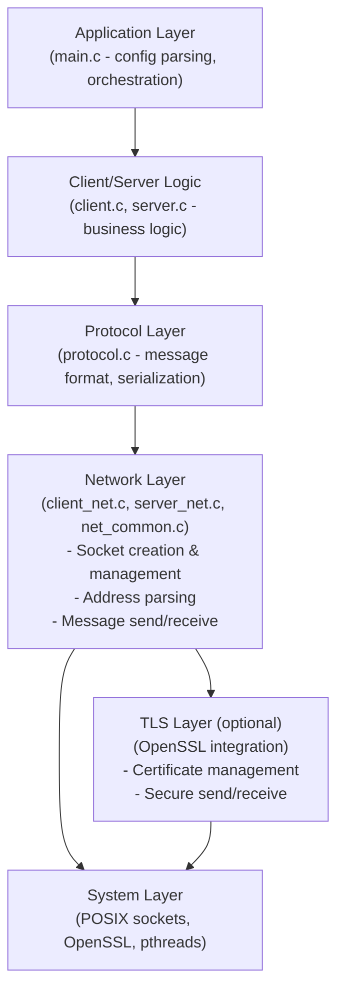
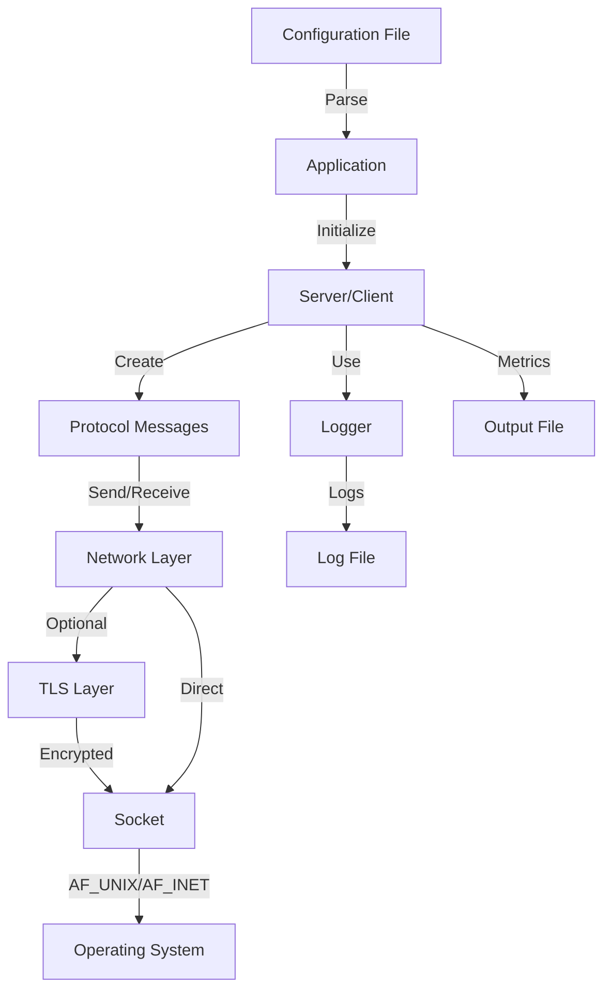
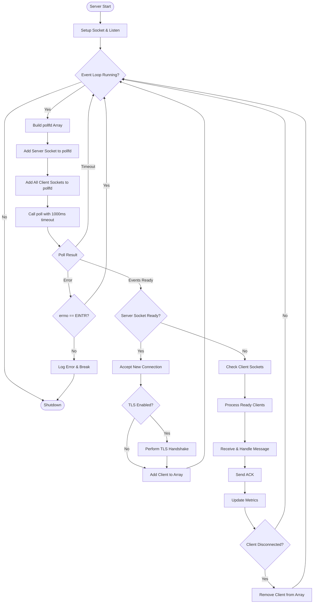
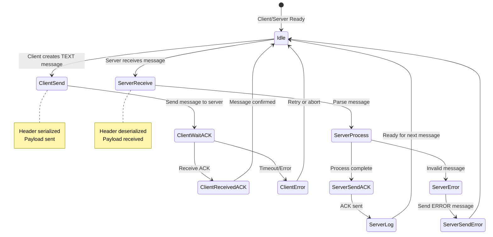
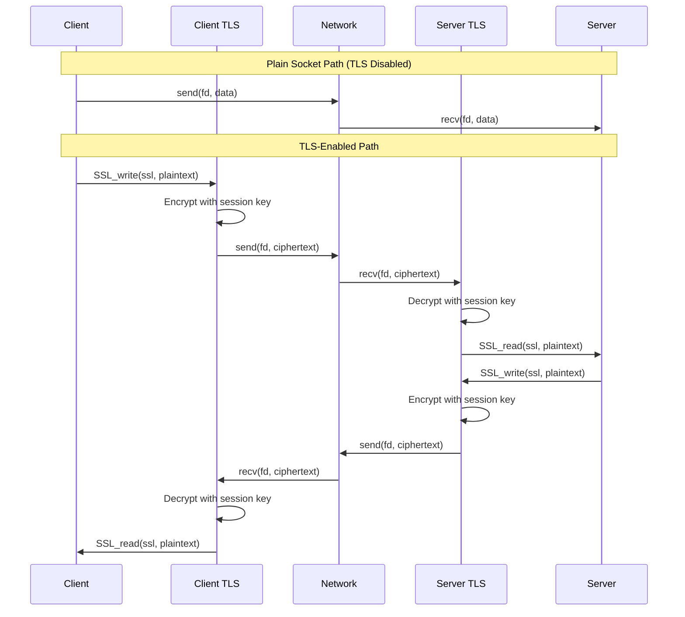
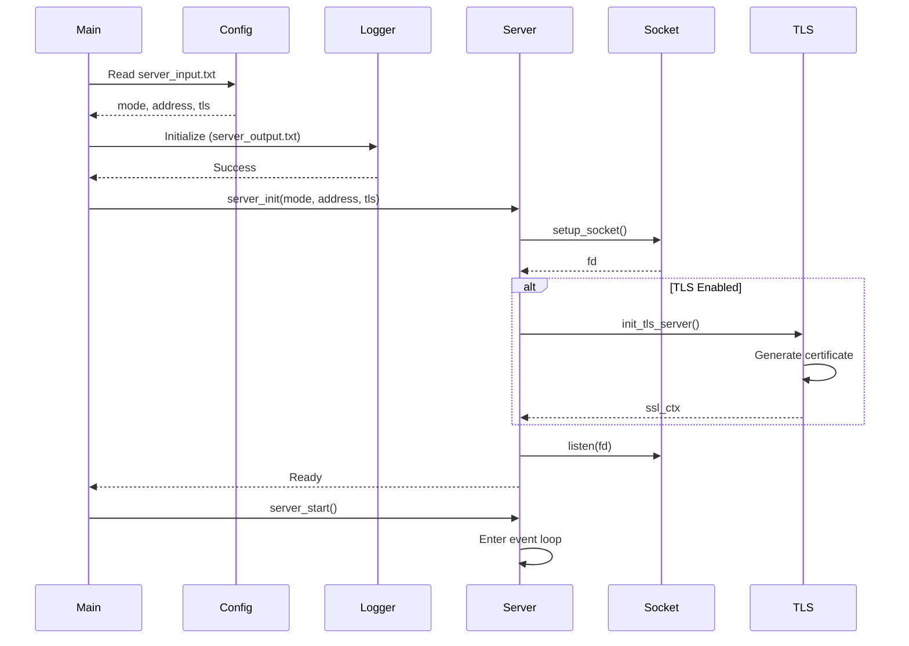
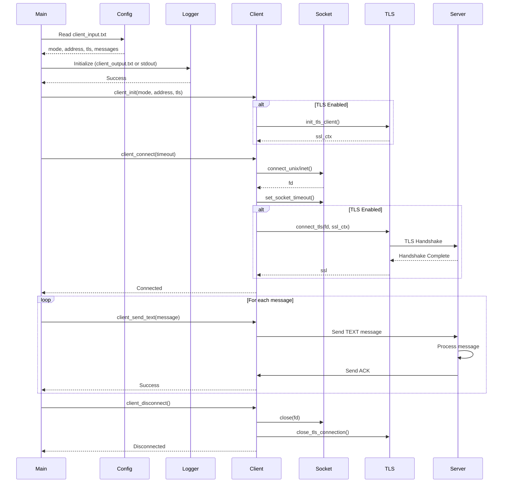
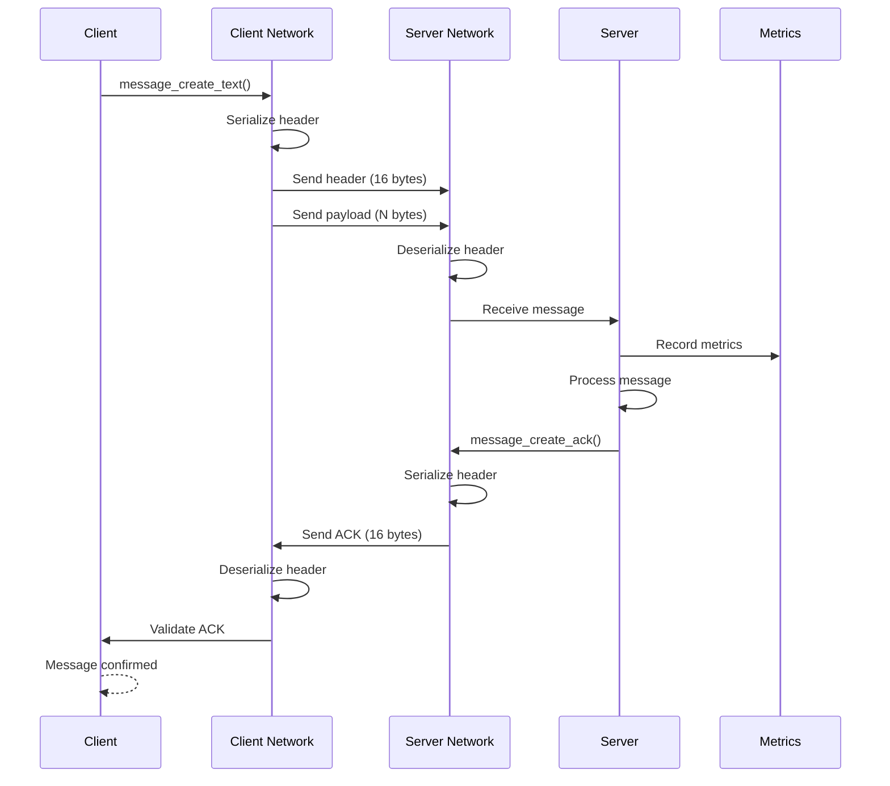
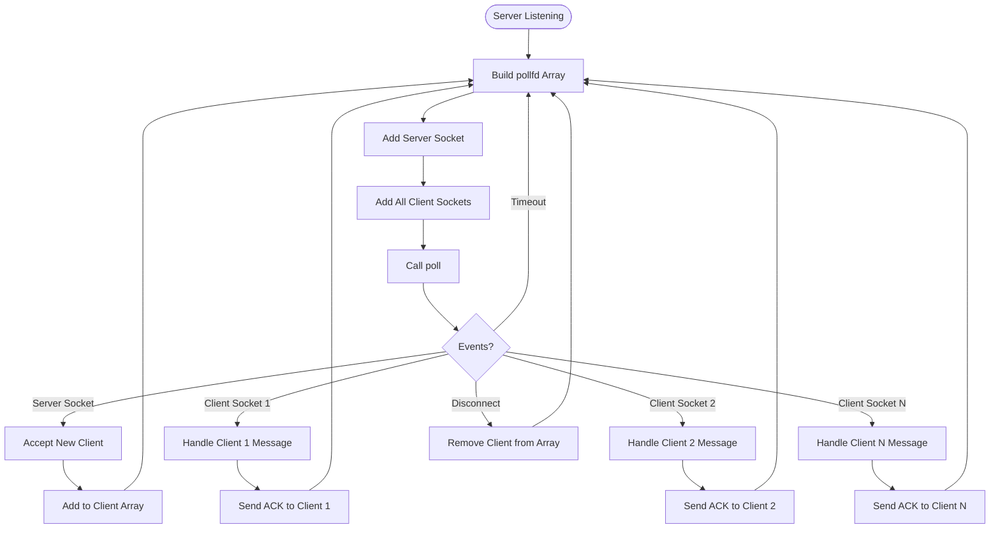

# Client-Server System - Comprehensive Technical Report

## 1. Introduction

### 1.1 Problem Statement

Inter-Process Communication (IPC) is a fundamental concept in system programming that enables processes to exchange data and coordinate their activities. In modern computing systems, understanding different IPC mechanisms is crucial for building distributed applications, microservices, and networked systems.

The primary challenge addressed by this project is the need for a practical, demonstrable implementation that showcases:

1. **Multiple IPC Transport Mechanisms**: Different socket types (Unix domain sockets vs Internet sockets) serve different use cases - local IPC vs network communication. A comprehensive system should support both to demonstrate their characteristics and trade-offs.

2. **Secure Communication**: In network-based IPC, data security is paramount. Implementing Transport Layer Security (TLS) demonstrates how to add encryption and authentication to IPC channels.

3. **Scalable Multi-Client Architecture**: Real-world servers must handle multiple concurrent clients efficiently. This requires understanding I/O multiplexing techniques and event-driven programming.

4. **Protocol Design**: Raw socket communication requires a structured protocol to ensure reliable message delivery, error handling, and data integrity.

5. **Production-Ready Features**: A complete system needs configuration management, logging, metrics collection, and proper resource cleanup.

### 1.2 Objectives

This project aims to implement and demonstrate a comprehensive client-server system that:

1. **Demonstrates Dual Socket Modes**:
   - **AF_UNIX (Unix Domain Sockets)**: For efficient local IPC between processes on the same machine
   - **AF_INET (Internet Sockets)**: For network-based communication across machines

2. **Implements Secure Communication**:
   - Optional TLS/SSL encryption using OpenSSL
   - Certificate-based authentication
   - Secure data transmission

3. **Supports Multi-Client Architecture**:
   - Concurrent client handling using `poll()` for I/O multiplexing
   - Dynamic client connection management
   - Graceful connection handling and cleanup

4. **Defines a Custom Protocol**:
   - Binary message format with fixed header structure
   - Message types (TEXT, ACK, ERROR)
   - Reliable delivery with acknowledgment mechanism
   - Network byte order handling

5. **Provides Production Features**:
   - File-based configuration system
   - Thread-safe logging with multiple log levels
   - Real-time metrics collection (throughput, latency, client count)
   - Comprehensive error handling

6. **Serves as Educational Demonstration**:
   - Clear code structure and modular design
   - Comprehensive documentation
   - Practical examples of system programming concepts
   - Demonstrates best practices in C system programming

The implementation showcases how these technologies work together to create a robust, secure, and scalable IPC system suitable for both local and network-based communication scenarios.

## 2. Theoretical Basics

### 2.1 System Programming Concepts

#### 2.1.1 Inter-Process Communication (IPC) Models

Inter-Process Communication refers to mechanisms that allow processes to exchange data and synchronize their execution. Common IPC mechanisms include:

1. **Pipes and Named Pipes (FIFOs)**: Unidirectional or bidirectional byte streams, typically for parent-child process communication
2. **Shared Memory**: Fast, but requires synchronization mechanisms (semaphores, mutexes)
3. **Message Queues**: Structured message passing with priorities
4. **Sockets**: Most flexible IPC mechanism, supporting both local and network communication

**Why Sockets?** Sockets provide a unified interface for both local IPC (Unix domain sockets) and network communication (Internet sockets). They offer:
- Bidirectional communication
- Connection-oriented (reliable) or connectionless (datagram) modes
- Standard POSIX API across Unix-like systems
- Support for multiple protocols (TCP, UDP, Unix domain)
- Built-in error detection and connection management

#### 2.1.2 Unix Domain Sockets (AF_UNIX) Fundamentals

Unix domain sockets provide efficient IPC between processes on the same machine. Key characteristics:

- **Address Space**: Uses filesystem paths as addresses (e.g., `/tmp/server.sock`)
- **File Descriptor Semantics**: Like regular files, Unix sockets appear as file descriptors in the process file descriptor table
- **Performance**: Faster than network sockets because:
  - No network stack overhead
  - Direct kernel-to-kernel data transfer
  - No network protocol headers
  - Typically 2-3x faster than TCP loopback
- **Security**: Can use filesystem permissions for access control
- **Address Structure**: `struct sockaddr_un` with `sun_family = AF_UNIX` and `sun_path` containing the socket file path

**Use Cases**: Local daemon communication, X11, database connections on same host, inter-process coordination.

#### 2.1.3 Internet Sockets (AF_INET) Fundamentals

Internet sockets enable communication across network boundaries using TCP/IP:

- **TCP/IP Layers**: 
  - Application Layer: Our protocol
  - Transport Layer: TCP (reliable, connection-oriented)
  - Network Layer: IP (routing)
  - Link Layer: Physical network interface
- **Address Binding**: Combines IP address (32-bit for IPv4) and port number (16-bit, 0-65535)
- **Address Structure**: `struct sockaddr_in` with:
  - `sin_family = AF_INET`
  - `sin_port`: Port number in network byte order
  - `sin_addr`: IP address structure
- **Network Byte Order**: All multi-byte values must be converted using `htonl()`, `htons()`, `ntohl()`, `ntohs()` to ensure portability across different endian architectures

**Use Cases**: Client-server applications, distributed systems, web services, remote procedure calls.

#### 2.1.4 Event-Driven I/O and Multiplexing

Traditional blocking I/O requires one thread/process per connection, which doesn't scale. Event-driven I/O multiplexing allows a single thread to monitor multiple file descriptors:

- **Blocking I/O**: `read()`/`write()` calls block until data is available or space is available
- **Non-Blocking I/O**: Set `O_NONBLOCK` flag; operations return immediately with `EAGAIN`/`EWOULDBLOCK` if not ready
- **I/O Multiplexing**: `select()`, `poll()`, or `epoll()` allow monitoring multiple file descriptors simultaneously
- **poll() System Call**: 
  - Takes array of `struct pollfd` with file descriptors and events to monitor
  - Blocks until one or more descriptors are ready or timeout occurs
  - Returns which descriptors have events (POLLIN, POLLOUT, POLLERR, POLLHUP)
  - More efficient than `select()` for large numbers of file descriptors

**Event Loop Pattern**: 
1. Add all file descriptors to poll set
2. Call `poll()` to wait for events
3. Process ready descriptors
4. Repeat

This pattern enables a single-threaded server to handle hundreds or thousands of concurrent connections efficiently.

#### 2.1.5 Transport Layer Security (TLS) Basics

TLS provides encryption, authentication, and data integrity for network communication:

- **TLS Handshake Process**:
  1. Client sends "ClientHello" with supported cipher suites
  2. Server responds with "ServerHello", selected cipher suite, and certificate
  3. Client verifies certificate and generates pre-master secret
  4. Both parties derive session keys
  5. Encrypted data exchange begins
- **Certificates**: X.509 certificates bind public keys to identities, signed by Certificate Authorities (CAs)
- **Encryption**: Symmetric encryption (AES) for bulk data, asymmetric (RSA/ECDSA) for key exchange
- **OpenSSL Library**: Provides SSL/TLS implementation, certificate management, and cryptographic functions

**In This Project**: We use OpenSSL to add TLS support, generating self-signed certificates for demonstration purposes.

### 2.2 Core Concepts Applied

#### 2.2.1 Custom Protocol Design Rationale

Raw sockets provide only a byte stream. A structured protocol is essential for:

- **Message Boundaries**: Delimiting where one message ends and another begins
- **Type Identification**: Distinguishing different message types (text, acknowledgment, error)
- **Length Information**: Knowing how much data to read for complete messages
- **Metadata**: Flags for compression, encryption, or other message properties

**Our Protocol Structure**:
- **Fixed 16-byte Header**: Ensures we can always read the header atomically
  - 4 bytes: Message type (uint32_t)
  - 8 bytes: Payload length (uint64_t) 
  - 4 bytes: Flags (uint32_t)
- **Variable Payload**: Length specified in header
- **Network Byte Order**: All multi-byte fields converted using `htonl()`/`ntohl()` for portability

This design allows receivers to:
1. Read exactly 16 bytes for the header
2. Parse message type and payload length
3. Allocate buffer and read exact payload size
4. Process complete message atomically

#### 2.2.2 Reliable Delivery & Acknowledgment Strategy

TCP provides reliable delivery at the transport layer, but application-level acknowledgments add:

- **Application-Level Confirmation**: Server explicitly confirms message receipt
- **Error Detection**: If ACK not received, client knows message may not have been processed
- **Flow Control**: Server can control message rate by delaying ACKs
- **Protocol Compliance**: Verifies both sides understand the protocol correctly

**Our ACK Mechanism**:
1. Client sends TEXT message
2. Server receives and processes message
3. Server sends ACK message (type = MSG_TYPE_ACK, no payload)
4. Client waits for ACK before considering message sent successfully
5. If ACK not received within timeout, client can retry

#### 2.2.3 File-Based Configuration and Logging

**Configuration Files**: 
- Simple key-value format (`key=value`)
- Allows runtime configuration without recompilation
- Supports defaults for missing values
- Easy to script and automate

**File-Based Logging**:
- Persistent record of system activity
- Can be analyzed post-execution
- Supports different log levels (INFO, WARN, ERROR)
- Thread-safe for multi-threaded scenarios
- Timestamped entries for debugging and auditing

### 2.3 Compact System Architecture Overview

The system is organized into modular components with clear separation of concerns:

**Module Stack**:



**Cross-Cutting Components**:
- **Logger** (`logger.c`): Thread-safe logging system used by all modules
- **Error Handling** (`error.c`): Centralized error code management
- **Utilities** (`utils.c`): Common helper functions

**Data Flow**:



This architecture ensures:
- **Modularity**: Each component has a single responsibility
- **Reusability**: Common components (protocol, network, logger) shared between client and server
- **Testability**: Components can be tested independently
- **Maintainability**: Clear interfaces between layers
- **Extensibility**: Easy to add new features (e.g., compression, new message types)

## 3. System Implementation & Design

### 3.1 Server Implementation

#### 3.1.1 Configuration Parsing & Initialization Pipeline

The server initialization process (`server/main.c`) follows a structured pipeline:

1. **Signal Handler Setup**: Registers handlers for `SIGINT` and `SIGTERM` to enable graceful shutdown
2. **Configuration Parsing**: Reads `server_input.txt` with key-value pairs:
   - `mode`: `unix` or `inet` (default: `inet`)
   - `address`: Socket path (UNIX) or `host:port` (INET)
   - `tls`: `0` or `1` (default: `0`)
3. **Logger Initialization**: Opens `server_output.txt` for logging
4. **TLS Validation**: Disables TLS for UNIX mode (not needed for local IPC)
5. **Server Initialization**: Calls `server_init()` to allocate and initialize server structure
6. **Server Start**: Calls `server_start()` which sets up socket and enters event loop

**Key Code Flow** (`server/main.c:127-183`):
```c
// Parse configuration from file
parse_config(INPUT_FILE, &mode, &address, &enable_tls)

// Initialize logger
logger_init(OUTPUT_FILE)

// Initialize server structure
server_init(&g_server, mode, address, enable_tls)

// Start server (blocks in event loop)
server_start(&g_server, message_handler)
```

#### 3.1.2 Socket Setup (UNIX/INET) and TLS Context Management

**Socket Setup** (`server/server.c:270-293`):

The `setup_socket()` function handles both socket types:

**Unix Domain Socket** (`server_net.c:25-52`):
1. Create socket: `socket(AF_UNIX, SOCK_STREAM, 0)`
2. Remove existing socket file: `unlink(socket_path)`
3. Fill `sockaddr_un` structure:
   - `sun_family = AF_UNIX`
   - `sun_path = socket_path` (max 107 bytes)
4. Bind socket: `bind(fd, (struct sockaddr*)&addr, sizeof(addr))`
5. Set socket options (reuse address)

**Internet Socket** (`server_net.c:54-88`):
1. Create socket: `socket(AF_INET, SOCK_STREAM, 0)`
2. Parse address: Extract host and port from `host:port` string
3. Fill `sockaddr_in` structure:
   - `sin_family = AF_INET`
   - `sin_port = htons(port)` (network byte order)
   - `sin_addr`: `INADDR_ANY` for localhost, or parsed IP
4. Bind socket: `bind(fd, (struct sockaddr*)&addr, sizeof(addr))`
5. Set socket options

**Non-Blocking Mode**: After socket creation, the server sets `O_NONBLOCK` flag using `fcntl()` to enable non-blocking I/O operations.

**TLS Context Management** (`server_net.c:90-175`):

If TLS is enabled, `init_tls_server()`:
1. Initializes OpenSSL library: `SSL_library_init()`, `SSL_load_error_strings()`
2. Creates SSL context: `SSL_CTX_new(TLS_server_method())`
3. Generates self-signed certificate (for demo):
   - Creates RSA key pair (2048 bits) using EVP API
   - Creates X.509 certificate
   - Sets certificate validity (1 year)
   - Signs certificate with private key
4. Loads certificate and key into context: `SSL_CTX_use_certificate()`, `SSL_CTX_use_PrivateKey()`

**TLS Connection Acceptance** (`server_net.c:177-193`):
- For each new client connection:
  1. Create new SSL object: `SSL_new(ctx)`
  2. Attach socket: `SSL_set_fd(ssl, fd)`
  3. Perform handshake: `SSL_accept(ssl)`
  4. Store SSL object in client connection structure

#### 3.1.3 Event Loop Algorithm (poll)

The server uses `poll()` for I/O multiplexing in a single-threaded event loop (`server/server.c:130-196`):

**Event Loop Flowchart**:



**Key Algorithm Steps**:

1. **Build Poll Set**: Dynamically allocate `struct pollfd` array to hold server socket + all client sockets
2. **Add Descriptors**: 
   - Index 0: Server socket (POLLIN for new connections)
   - Indices 1..N: Client sockets (POLLIN for data, POLLHUP/POLLERR for disconnects)
3. **Call poll()**: Block for up to 1000ms waiting for events
4. **Process Server Socket**: If `pollfds[0].revents & POLLIN`, accept new connection
5. **Process Client Sockets**: For each client with `POLLIN`, receive and process message
6. **Handle Disconnects**: If `POLLHUP` or `POLLERR`, remove client from array
7. **Repeat**: Loop continues while `server->running == 1`

**Dynamic Array Management**: The pollfd array is reallocated when client count changes to minimize memory allocations.

#### 3.1.4 Client Lifecycle (Accept/Add/Remove, Dynamic Arrays)

**Client Connection Structure** (`server/server.h:20-24`):
```c
typedef struct {
    int fd;           // File descriptor
    void* ssl;        // SSL* pointer (if TLS enabled)
    int is_ssl;       // Boolean flag
} ClientConnection;
```

**Adding Clients** (`server/server.c:24-41`):
- When new connection accepted:
  1. Check if client array needs expansion (doubles capacity when full)
  2. Allocate new `ClientConnection` at end of array
  3. Store file descriptor and SSL object
  4. Increment `client_count` and `total_clients`
  5. Log connection event

**Dynamic Array Growth**: Uses exponential growth (starts at 8, doubles when full) to balance memory usage and performance.

**Removing Clients** (`server/server.c:43-61`):
- When client disconnects or error occurs:
  1. Close TLS connection if enabled: `close_tls_connection()`
  2. Close file descriptor: `close(fd)`
  3. Shift remaining clients in array to fill gap
  4. Decrement `client_count`
  5. Log disconnection event

**Array Compaction**: Clients are removed by shifting elements, maintaining contiguous array. This is O(n) but acceptable for typical client counts.

#### 3.1.5 Message Handling (Receive, Metrics, ACK)

**Message Reception** (`server/server.c:85-128`):

When a client socket has data available:

1. **Receive Message**: Call `receive_message()` which:
   - Reads 16-byte header atomically
   - Deserializes header (network to host byte order)
   - Allocates payload buffer based on `header.length`
   - Reads payload data
   - Returns `Message` structure

2. **Record Metrics**:
   - **Message Count**: Increment `total_messages`
   - **Byte Count**: Add `payload_size` to `total_bytes`
   - **Interval Timing**: Calculate time since last message
     - Track `min_interval_ms`, `max_interval_ms`
     - Calculate average: `total_interval_ms / interval_count`
   - **Timestamp**: Store current time for next interval calculation

3. **Process Message**: Call registered `MessageHandler` callback (if provided)
   - Default handler logs text messages

4. **Send ACK**: For non-ACK messages:
   - Create ACK message: `message_create_ack()`
   - Send via `send_message()` (handles TLS if enabled)
   - Free ACK message

5. **Free Message**: Release payload memory: `message_free()`

**Error Handling**: If `receive_message()` fails (connection closed, protocol error), the client is immediately removed from the connection list.

#### 3.1.6 Metrics Collection Logic

The server tracks comprehensive metrics throughout its lifetime (`server/server.c:327-369`):

**Metrics Tracked**:
- `total_clients`: Total number of clients that connected (cumulative)
- `total_messages`: Total messages received
- `total_bytes`: Total bytes received (for throughput calculation)
- `start_time`: Server start timestamp (for uptime)
- `last_message_time`: Timestamp of last message (for intervals)
- `total_interval_ms`: Sum of intervals between messages
- `min_interval_ms`: Minimum interval between messages
- `max_interval_ms`: Maximum interval between messages
- `interval_count`: Number of intervals measured

**Metrics Calculation** (`server/server.c:327-369`):

At shutdown, `server_get_metrics()` calculates:

1. **Uptime**: `current_time - start_time` (seconds)
2. **Throughput**: `(total_bytes / (1024 * 1024)) / uptime` (MB/s)
3. **Average Latency**: `total_interval_ms / interval_count` (ms)
4. **Min/Max Latency**: Directly from tracked values

**Metrics Output** (`server/main.c:103-125`):
```
=== SERVER METRICS ===
Mode: inet
Address: localhost:8080
TLS Enabled: No
Total Clients: 5
Total Messages Received: 42
Uptime: 123.45 seconds
Message Rate: 0.34 msg/s
Average Latency: 12.34 ms
Throughput: 0.0012 MB/s
```

These metrics provide insights into server performance, load patterns, and help identify bottlenecks.

### 3.2 Client Implementation

#### 3.2.1 Configuration Parsing & Logging Behavior

The client initialization (`client/main.c`) follows a similar pattern to the server:

1. **Configuration Parsing**: Reads `client_input.txt` with:
   - `mode`: `unix` or `inet`
   - `address`: Server address
   - `tls`: `0` or `1`
   - `free_input`: `0` (file mode) or `1` (interactive mode)
   - `message`: One or more messages to send (file mode only)

2. **Logger Initialization**: 
   - File mode: Logs to `client_output.txt`
   - Interactive mode (`free_input=1`): Logs to `stdout` for real-time feedback

3. **Client Initialization**: Calls `client_init()` to allocate and initialize client structure

4. **Connection**: Calls `client_connect()` with retry logic

5. **Message Sending**: 
   - File mode: Sends all messages from config file sequentially
   - Interactive mode: Reads from stdin until "quit" or "exit"

**Key Code Flow** (`client/main.c:112-209`):
```c
// Parse configuration and messages
parse_config(INPUT_FILE, &mode, &address, &enable_tls, 
             &free_input, &messages, &message_count)

// Initialize logger (file or stdout)
logger_init(free_input ? NULL : OUTPUT_FILE)

// Initialize client
client_init(&client, mode, address, enable_tls)

// Connect with retry
client_connect(&client, 5)  // 5 second timeout

// Send messages (file or interactive)
if (free_input) {
    // Interactive: read from stdin
} else {
    // File: send all messages from array
}
```

#### 3.2.2 Connection Strategy (Timeouts, Retries, TLS Handshake)

**Connection Process** (`client/client.c:57-130`):

The client implements robust connection logic with exponential backoff retry:

1. **Retry Loop**: Attempts connection up to 5 times with exponential backoff
   - Retry 1: Wait 1 second (2^0)
   - Retry 2: Wait 2 seconds (2^1)
   - Retry 3: Wait 4 seconds (2^2)
   - Retry 4: Wait 8 seconds (2^3)
   - Retry 5: Wait 16 seconds (2^4)

2. **Socket Creation**:
   - **UNIX Mode**: `connect_unix_socket()` creates AF_UNIX socket and connects to socket file
   - **INET Mode**: `connect_inet_socket()` creates AF_INET socket, parses address, connects to host:port

3. **Timeout Setting**: Sets socket timeout using `setsockopt(SO_RCVTIMEO, SO_SNDTIMEO)` for 5 seconds

4. **TLS Handshake** (if enabled):
   - Creates SSL object: `SSL_new(ctx)`
   - Attaches socket: `SSL_set_fd(ssl, fd)`
   - Performs handshake: `SSL_connect(ssl)`
   - On failure, closes socket and retries

5. **Connection Success**: Sets `client->connected = 1` and logs success

**Error Recovery**: Each step (socket creation, timeout setting, TLS handshake) can fail and trigger retry with backoff, ensuring resilience against temporary network issues or server unavailability.

#### 3.2.3 Message Dispatch Loop (File-Based vs Interactive)

**File-Based Mode** (`client/main.c:188-198`):

When `free_input=0`, the client:
1. Iterates through all messages from config file
2. For each message:
   - Logs: "Sending message: {message}"
   - Calls `client_send_text()` which:
     - Creates TEXT message
     - Sends via `send_message()`
     - Waits for ACK
     - Validates ACK type
   - Logs success or error
3. Disconnects after all messages sent

**Interactive Mode** (`client/main.c:167-187`):

When `free_input=1`, the client:
1. Prints prompt: "Connected. Type messages to send..."
2. Enters loop reading from `stdin`:
   - Reads line with `fgets()`
   - Removes newline
   - Checks for "quit" or "exit" to break
   - Skips empty lines
   - Sends message via `client_send_text()`
   - Logs result
3. Disconnects when user types "quit" or "exit"

**Message Sending Logic** (`client/client.c:155-184`):

`client_send_text()` implements reliable message delivery:

1. **Validation**: Checks `client_is_connected()` 
2. **Message Creation**: `message_create_text(text, text_len)`
3. **Send Message**: Calls `send_message()` which handles:
   - Header serialization (host to network byte order)
   - TLS encryption (if enabled)
   - Socket send operation
4. **Wait for ACK**: Calls `receive_message()` to get server response
5. **Validate ACK**: Ensures received message type is `MSG_TYPE_ACK`
6. **Cleanup**: Frees message structures
7. **Return**: 0 on success, -1 on error

This ensures each message is confirmed by the server before the client considers it successfully sent.

#### 3.2.4 Cleanup and Resource Management

**Disconnection** (`client/client.c:132-149`):

When disconnecting:
1. **TLS Cleanup**: If TLS enabled, calls `close_tls_connection()`:
   - `SSL_shutdown(ssl)` to gracefully close TLS connection
   - `SSL_free(ssl)` to free SSL object
2. **Socket Cleanup**: Closes file descriptor: `close(fd)`
3. **State Reset**: Sets `connected = 0`, `fd = -1`, `ssl = NULL`
4. **Logging**: Logs disconnection event

**Client Cleanup** (`client/client.c:44-55`):

On client destruction:
1. Calls `client_disconnect()` to close active connection
2. Cleans up TLS context: `cleanup_tls(ctx)` which:
   - Frees SSL_CTX: `SSL_CTX_free()`
   - Cleans up OpenSSL: `EVP_cleanup()`
3. Frees address string: `free(address)`
4. Zeros structure: `memset(client, 0, sizeof(Client))`

**Memory Management**: All dynamically allocated resources (address strings, SSL contexts, messages) are properly freed to prevent memory leaks.

### 3.3 Protocol Layer

#### 3.3.1 Detailed Header Layout

The protocol uses a fixed 16-byte header structure defined in `protocol.h`:

**MessageHeader Structure**:
```c
typedef struct {
    uint32_t type;      // 4 bytes: Message type
    uint64_t length;    // 8 bytes: Payload length
    uint32_t flags;     // 4 bytes: Message flags
} __attribute__((packed)) MessageHeader;
```

**Byte Layout** (network byte order on wire):

| Offset | Size | Field | Description |
|--------|------|-------|-------------|
| 0 | 4 | type | Message type (MSG_TYPE_TEXT, MSG_TYPE_ACK, MSG_TYPE_ERROR) |
| 4 | 8 | length | Payload size in bytes (0 for ACK messages) |
| 12 | 4 | flags | Message flags (compression, encryption, etc.) |
| 16 | N | payload | Variable-length payload data |

**Packed Attribute**: `__attribute__((packed))` ensures no compiler padding between fields, guaranteeing exact 16-byte size.

#### 3.3.2 Serialization/Deserialization Steps

**Serialization** (`protocol.h:65-69` - `message_header_serialize()`):

Before sending, header is converted to network byte order:
```c
header->type = htonl(header->type);        // 32-bit host to network
header->length = htobe64(header->length);  // 64-bit host to network (big-endian)
header->flags = htonl(header->flags);      // 32-bit host to network
```

**Deserialization** (`protocol.h:74-78` - `message_header_deserialize()`):

After receiving, header is converted from network byte order:
```c
header->type = ntohl(header->type);        // 32-bit network to host
header->length = be64toh(header->length);  // 64-bit network to host (big-endian)
header->flags = ntohl(header->flags);      // 32-bit network to host
```

**Why Network Byte Order?**: Ensures portability across machines with different endianness (little-endian x86 vs big-endian architectures).

**Send Process** (`net_common.c:16-47`):
1. Create local copy of header
2. Serialize header (host to network byte order)
3. Send header (16 bytes) atomically
4. If payload exists, send payload (exact `length` bytes)
5. Use `SSL_write()` for TLS or `send()` for plain socket

**Receive Process** (`net_common.c:49-97`):
1. Receive header (16 bytes) atomically using `MSG_WAITALL` or `SSL_read()`
2. Deserialize header (network to host byte order)
3. Validate `length` field
4. If `length > 0`, allocate buffer and receive payload
5. Return complete `Message` structure

#### 3.3.3 Message Constructors (Text, ACK, Error)

**Text Message** (`protocol.c:10-30` - `message_create_text()`):
```c
Message message_create_text(const char* text, size_t text_len) {
    Message msg;
    msg.header.type = MSG_TYPE_TEXT;      // 0x01
    msg.header.length = text_len;
    msg.header.flags = MSG_FLAGS_NONE;
    
    if (text_len > 0) {
        msg.payload = malloc(text_len);    // Allocate payload
        memcpy(msg.payload, text, text_len); // Copy text data
        msg.payload_size = text_len;
    } else {
        msg.payload = NULL;
        msg.payload_size = 0;
    }
    return msg;
}
```

**ACK Message** (`protocol.c:32-40` - `message_create_ack()`):
```c
Message message_create_ack(void) {
    Message msg;
    msg.header.type = MSG_TYPE_ACK;       // 0x03
    msg.header.length = 0;                // No payload
    msg.header.flags = MSG_FLAGS_NONE;
    msg.payload = NULL;
    msg.payload_size = 0;
    return msg;
}
```

**Error Message** (`protocol.c:42-62` - `message_create_error()`):
- Similar to text message but with `MSG_TYPE_ERROR` (0x04)
- Used for protocol errors or server-side error reporting

**Message Cleanup** (`protocol.c:64-70` - `message_free()`):
- Frees payload buffer if allocated
- Resets payload pointer and size
- Header is stack-allocated, no cleanup needed

#### 3.3.4 State Machine Diagram for Message Exchange



**State Transitions**:
- **Idle**: Both client and server waiting
- **ClientSend**: Client has sent message, waiting for ACK
- **ClientWaitACK**: Client waiting for server response
- **ClientReceivedACK**: Client received valid ACK, message confirmed
- **ServerReceive**: Server received message header and payload
- **ServerProcess**: Server parsing and processing message
- **ServerSendACK**: Server sending acknowledgment
- **Error States**: Handle protocol errors, timeouts, invalid messages

This state machine ensures reliable message delivery with explicit acknowledgment at the application layer.

### 3.4 Network Utilities & TLS Layer

#### 3.4.1 Address Parsing Helpers

**Address Parsing** (`utils.c:16-31` - `parse_address()`):

Parses `host:port` format for INET sockets:
1. Duplicates address string for modification
2. Finds colon separator: `strchr(addr_copy, ':')`
3. Splits string: sets `*colon = '\0'` to terminate host part
4. Parses port: `atoi(port_str)` converts port string to integer
5. Returns host string (caller must free)

**Example**: `"localhost:8080"` → host=`"localhost"`, port=`8080`

#### 3.4.2 Socket Utilities

**Socket Timeout** (`utils.c:33-47` - `set_socket_timeout()`):

Sets both receive and send timeouts:
```c
struct timeval timeout;
timeout.tv_sec = timeout_sec;
timeout.tv_usec = 0;
setsockopt(fd, SOL_SOCKET, SO_RCVTIMEO, &timeout, sizeof(timeout));
setsockopt(fd, SOL_SOCKET, SO_SNDTIMEO, &timeout, sizeof(timeout));
```

**Socket Reuse** (`utils.c:49-55` - `set_socket_reuse()`):

Enables `SO_REUSEADDR` option to allow binding to recently closed addresses:
- Prevents "Address already in use" errors
- Useful for server restarts
- Sets `SO_REUSEADDR = 1` via `setsockopt()`

**Error String Conversion** (`utils.c:57-59` - `get_error_string()`):
- Wraps `strerror()` to convert `errno` to human-readable string
- Used throughout codebase for error logging

#### 3.4.3 TLS Setup Helpers

**Server TLS Initialization** (`server_net.c:90-175` - `init_tls_server()`):

1. **OpenSSL Initialization**:
   - `SSL_library_init()`: Initializes OpenSSL library
   - `SSL_load_error_strings()`: Loads error message strings
   - `OpenSSL_add_all_algorithms()`: Registers all crypto algorithms

2. **SSL Context Creation**:
   - `SSL_CTX_new(TLS_server_method())`: Creates server SSL context
   - Configures for TLS 1.2+ protocol

3. **Certificate Generation** (for demo):
   - Creates RSA 2048-bit key pair using EVP API
   - Creates X.509 certificate with:
     - Serial number: 1
     - Validity: 1 year from now
     - Subject/Issuer: CN=localhost
   - Signs certificate with private key
   - Loads into SSL context

**Client TLS Initialization** (`client_net.c:77-94` - `init_tls_client()`):

1. **OpenSSL Initialization**: Same as server
2. **SSL Context Creation**: `SSL_CTX_new(TLS_client_method())`
3. **Certificate Verification**: `SSL_CTX_set_verify(ctx, SSL_VERIFY_NONE, NULL)`
   - For demo: disables certificate verification
   - Production: should verify server certificates

**TLS Connection** (`client_net.c:96-112` - `connect_tls()`):

1. Create SSL object: `SSL_new(ctx)`
2. Attach socket: `SSL_set_fd(ssl, fd)`
3. Perform handshake: `SSL_connect(ssl)`
4. Returns SSL object on success, NULL on failure

**TLS Acceptance** (`server_net.c:177-193` - `accept_tls_connection()`):

1. Create SSL object: `SSL_new(ctx)`
2. Attach socket: `SSL_set_fd(ssl, fd)`
3. Perform handshake: `SSL_accept(ssl)`
4. Returns SSL object on success, NULL on failure

#### 3.4.4 Secure Send/Receive Wrappers

**Secure Send** (`net_common.c:16-47` - `send_message()`):

Handles both plain and TLS-encrypted sending:
```c
if (is_ssl && ssl) {
    sent = SSL_write((SSL*)ssl, data, size);  // TLS encrypted
} else {
    sent = send(fd, data, size, 0);          // Plain socket
}
```

**Secure Receive** (`net_common.c:49-97` - `receive_message()`):

Handles both plain and TLS-encrypted receiving:
```c
if (is_ssl && ssl) {
    received = SSL_read((SSL*)ssl, buffer, size);  // TLS decrypted
} else {
    received = recv(fd, buffer, size, MSG_WAITALL); // Plain socket
}
```

**TLS Cleanup** (`net_common.c:99-111`):

- `close_tls_connection()`: Shuts down SSL connection gracefully
  - `SSL_shutdown(ssl)`: Initiates TLS shutdown handshake
  - `SSL_free(ssl)`: Frees SSL object
- `cleanup_tls()`: Cleans up SSL context
  - `SSL_CTX_free(ctx)`: Frees SSL context
  - `EVP_cleanup()`: Cleans up OpenSSL EVP

#### 3.4.5 Diagram for TLS-Enabled Data Path



**TLS Encryption Flow**:
1. Application data (plaintext) passed to SSL layer
2. SSL encrypts using negotiated cipher suite and session keys
3. Encrypted data (ciphertext) sent over network
4. Receiving SSL layer decrypts using same keys
5. Plaintext delivered to application

This provides end-to-end encryption, ensuring data confidentiality even if network is compromised.

### 3.5 Logging & Configuration Systems

#### 3.5.1 Thread-Safe Logger Design

**Logger Structure** (`logger.c`):

The logger uses a static mutex to ensure thread safety:
```c
static FILE* log_file = NULL;
static LogLevel log_level = LOG_LEVEL_INFO;
static pthread_mutex_t log_mutex = PTHREAD_MUTEX_INITIALIZER;
```

**Logging Functions** (`logger.c:61-88`):

All logging operations are protected by mutex:
1. **Lock Mutex**: `pthread_mutex_lock(&log_mutex)`
2. **Check Log Level**: Skip if message level below threshold
3. **Format Timestamp**: `strftime()` formats current time
4. **Write Log**: `fprintf()` writes to file or stdout
5. **Flush**: `fflush()` ensures immediate write
6. **Unlock Mutex**: `pthread_mutex_unlock(&log_mutex)`

**Log Levels**:
- `LOG_LEVEL_INFO`: Informational messages (default)
- `LOG_LEVEL_WARN`: Warning messages
- `LOG_LEVEL_ERROR`: Error messages

**Logger Initialization** (`logger.c:18-33`):
- Opens file for writing (overwrites existing)
- Falls back to `stdout` if file open fails
- Thread-safe initialization

**Logger Cleanup** (`logger.c:35-44`):
- Closes file (if not stdout)
- Resets log_file pointer
- Thread-safe cleanup

#### 3.5.2 Config File Grammar

**Configuration File Format**:

Simple key-value pairs, one per line:
```
key=value
```

**Supported Keys**:

**Server** (`server_input.txt`):
- `mode=unix|inet` - Socket mode
- `address=<path>|<host:port>` - Server address
- `tls=0|1` - Enable TLS

**Client** (`client_input.txt`):
- `mode=unix|inet` - Socket mode
- `address=<path>|<host:port>` - Server address
- `tls=0|1` - Enable TLS
- `free_input=0|1` - Interactive mode
- `message=<text>` - Message to send (multiple allowed)

**Parsing Logic** (`server/main.c:33-88`, `client/main.c:19-101`):

1. Open file: `fopen(filename, "r")`
2. Read line by line: `fgets(line, MAX_LINE_LEN, f)`
3. Remove newline: `line[strcspn(line, "\n")] = '\0'`
4. Skip empty lines and comments (lines starting with `#`)
5. Find equals sign: `strchr(line, '=')`
6. Split: `*eq = '\0'` to separate key and value
7. Parse value based on key
8. Set defaults if keys missing

**Default Values**:
- `mode`: `inet` (if not specified)
- `address`: `/tmp/server.sock` (UNIX) or `localhost:8080` (INET)
- `tls`: `0` (disabled)
- `free_input`: `0` (file mode)

**Validation**:
- UNIX mode with TLS: Automatically disables TLS (logged as warning)
- Invalid addresses: Connection will fail, error logged
- Missing required keys: Uses defaults

### 3.6 Feature Flows & Diagrams

#### 3.6.1 Server Startup Sequence



#### 3.6.2 Client Session Sequence



#### 3.6.3 Message Exchange Sequence



#### 3.6.4 Multi-Client Handling Flow



**Key Points**:
- Single event loop handles all clients
- `poll()` monitors server + all client sockets simultaneously
- Each client processed independently
- New clients added dynamically
- Disconnected clients removed immediately

### 3.7 Build & Deployment Considerations

#### 3.7.1 Makefile Targets

**Build Targets** (`Makefile`):

- **`all`** (default): Builds both `run_server` and `run_client`
- **`run_server`**: Links server executable
- **`run_client`**: Links client executable
- **`clean`**: Removes all object files, executables, and output files

**Compilation Flags**:
```makefile
CC = gcc
CFLAGS = -Wall -Wextra -O2 -pthread -std=c11
LDFLAGS = -pthread -lssl -lcrypto -lm
```

- `-Wall -Wextra`: Enable all warnings
- `-O2`: Optimization level 2
- `-pthread`: POSIX threads support
- `-std=c11`: C11 standard
- `-lssl -lcrypto`: OpenSSL libraries
- `-lm`: Math library (for `pow()`)

**Dependency Management**:
- Common objects built first
- Server/Client objects depend on common objects
- Executables link all required objects

#### 3.7.2 Dependency Requirements

**System Libraries**:
- **OpenSSL**: `libssl-dev` (Ubuntu/Debian) or `openssl` (Arch)
  - Provides TLS/SSL functionality
  - Certificate management
  - Cryptographic operations

- **POSIX Libraries**: Standard on Unix-like systems
  - `pthread`: Thread support (for mutex in logger)
  - Socket APIs: `sys/socket.h`, `netinet/in.h`
  - System calls: `unistd.h`, `fcntl.h`

**Compiler Requirements**:
- GCC 5+ or Clang 5+
- C11 standard support
- POSIX.1-2008 support (`_POSIX_C_SOURCE`)

#### 3.7.3 Runtime Files

**Input Files** (created by user):
- `server_input.txt`: Server configuration
- `client_input.txt`: Client configuration and messages

**Output Files** (created by programs):
- `server_output.txt`: Server logs and metrics
- `client_output.txt`: Client status and logs

**Socket Files** (UNIX mode only):
- Socket file at specified path (e.g., `/tmp/server.sock`)
- Automatically removed on server shutdown

**Cleanup Command**:
```bash
make clean
```
Removes:
- All `.o` object files
- Executables (`run_server`, `run_client`)
- Output files (`server_output.txt`, `client_output.txt`)
- Test files

**Deployment Steps**:
1. Install dependencies: `sudo apt-get install build-essential libssl-dev`
2. Build: `make`
3. Create configuration files
4. Run server: `./run_server`
5. Run client: `./run_client`
6. Review logs in output files
